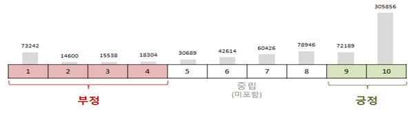
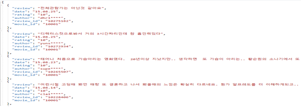
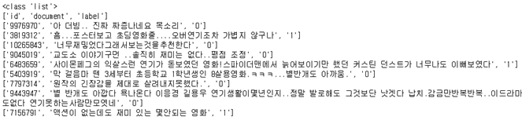
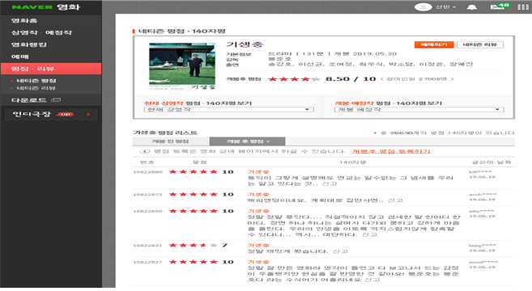
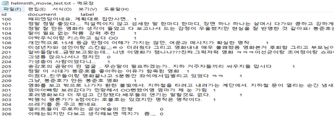
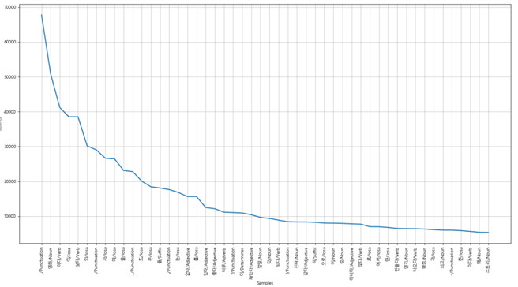
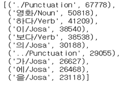
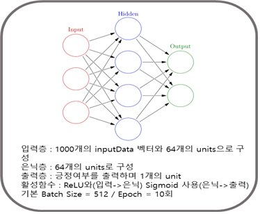

### Naver_Movie_Review_sentiment_analysis
## 네이버 영화 리뷰 데이터를 이용한 기생충 영화 리뷰 감성분석 (긍-부정)

## ■ 프로젝트 주제 
- KoNLPy와 Naver Sentiment movie corpus를 이용한 한국어 영화 리뷰 감성 분석 (Feat. 영화 기생충 리뷰에 감성을 분석하여 평점과 비교해보기)
   
## ■ 프로젝트 수행 과정 
○ 분야 및 분석 동기(motivation) 결정
- 영화 평점은 수치상으로 매길수있게 0~10까지 정해져있고, 영화 리뷰에는 영화에 대한 자신의 생각이 담긴 진솔하고 좋은 리뷰들이 많다. 리뷰를 작성하고 평점을 매기는 것은 평점을 먼저 매기고 리뷰를 쓰는 것보다 더 영화에 대한 정확하게 평점을 매길 수 있다. 이러한 리뷰들을 가지고 감정 분석을 하여 평점을 예측할 수 있게 된다면 평점이 본인이 진솔하게 쓴 리뷰에 의해 자동으로 측정되어 영화에 대한 보다 객관적이고 정확한 평가가 될 수 있을 것이다. 또한 그렇게 되면 더 신뢰성있는 평점과 좋은 리뷰문화가 형성 될 것이다.
   
## ○ 관련 데이터 수집
- 훈련데이터 셋 : 한국어로 된 영화 리뷰 데이터 (github 제공 : https://github.com/e9t/nsmc/ ) 
(** 리뷰 수집방법 : http://ai.stanford.edu/~amaas/data/sentiment/ 에 의거한 Large Movie Review Dataset 방법을 사용함)
- 테스트데이터 셋 : 영화 기생충 크롤링을 통한 영화 리뷰 및 평점 데이터 수집
   
## ○ 데이터 특징 
- 네이버 영화의 리뷰 중 영화당 100개의 리뷰를 모아 총 200,000개의 리뷰(train: 15만, test:5만)으로 구성
- 직접 크롤링으로 수집한 기생충 영화의 리뷰는 100개 정도. (실제 Test Data)
- 모든 리뷰는 140자 미만으로 구성됨.
- 1-10점까지의 영화 평점 중 5-8점 중립은 제외하고, 1-4 점은 부정(0), 9~10점은 긍정(1)으로 분류

   
## ○ 데이터 형태 미리보기

- row data (평점 1점 ~ 4점 : 부정 , 9점~10점 : 긍정)

- id, document, label(긍정, 부정)으로 분류된 기존 훈련 데이터 (ratings_trains.txt) -
   
## ○ 분석 작업에 필요한 데이터 형태로 전처리   
(1) txt 형태의 훈련데이터 파일을 읽어들여서 list형태로 저장   
(2) list 형태의 데이터를 tokenize화 한다. (json 형태로 저장)   
(3) json 형태의 데이터를 문자열형태로 변환 (json.dump)   
(4) nltk(Natural Language Tool Kit) 패키지를 이용하여 토큰 데이터를 nltk.Text로 묶고 중복제거   
(5) 크롤링을 통해 테스트 데이터 수집 (Beautiful Soup 이용)   

- 네이버 영화 (기생충) 리뷰 및 평점 -
- https://movie.naver.com/movie/point/af/list.nhn?st=mcode&sword=161967&target=after

- 크롤링을 통해 자동 수집하여 생성한 helminth_movie_test.txt (영화 기생충)
- 정답라벨링 학습데이터 평가방식과 동일
   
## ○ 다양한 분석 수행   
(1) 상위 50개의 토큰 빈도수 추출 및 plot 시각화 (실제 사용은 1000개, 3000개, 5000개)
 
 
 - 전체 49895개의 토큰 중 많이 나온 상위 1000개로 진행
   
## ○ 텐서플로우 케라스를 이용한 모델 생성

